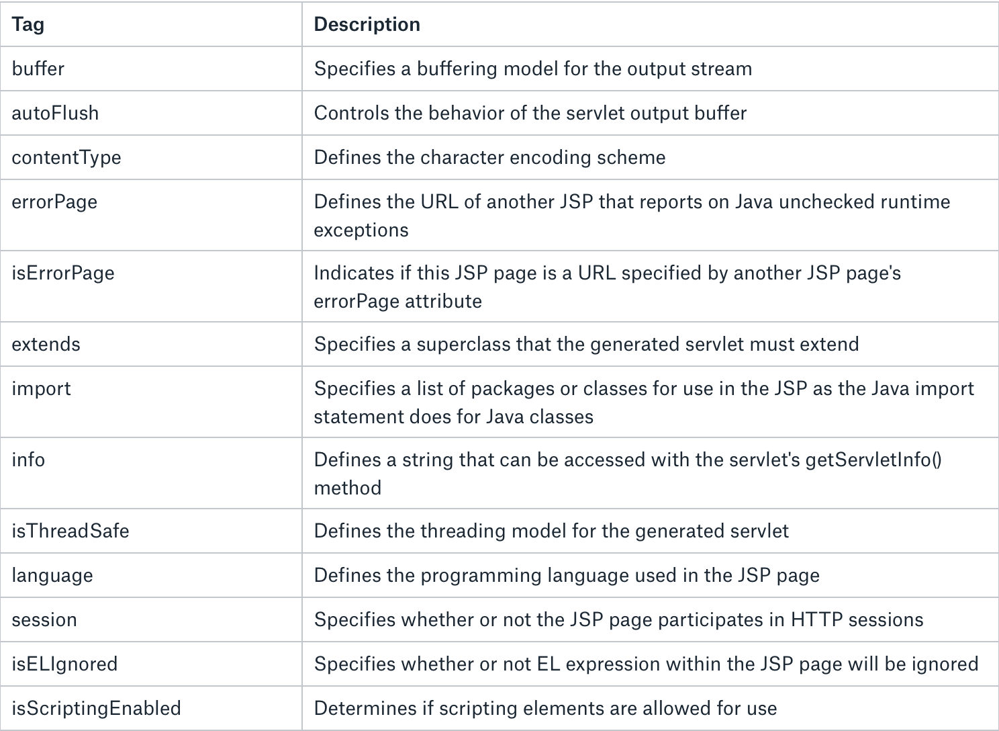
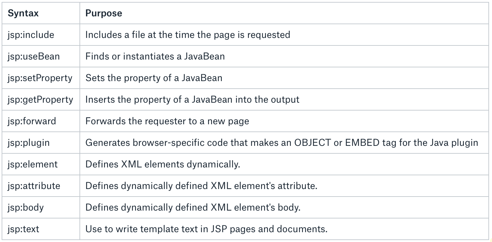

# User interface  - JSP

## What is JSP
- adds dynamic content to web pages
- JSP 2.2 (JSR 340)
## How JSP works
- the request from client is directed to JSP engine
- engine identifies JSP page and converts it into servlet
- the servlet produces HTML and send it to client via response
- the servlet is converted from JSP once (not considered JSP page change)
## JSP lifecycle
- compilation, initialization,execution,cleanup
- jspInit() and jspDestroy() can be overriden


## JSP Scripting elements
- comment  `<%-- This is comment--%>` 
- directive `<%@ directive %>` 
- declaration  `<%!`declarations %>` 
- scriptlet `<% scriptlet %>` 
- expression `<%= expression  =>` 


## JSP Sciptlet Tag
- `<% java code %>` 
- allows to write java code in JSP page
```
       <html>
         <head>
            <meta http-equiv="Content-Type" content="text/html; charset=UTF-8">
            <title>Welcome Page</title>
        </head>
       <%
          // Retrieve user parameter
          String user = request.getParameter("user");
       %>
      <body>
            Hello, <% out.println(user); %>
      </body>
    </html>
```

## JSP Declaration Tag
- `<%! declaration %>` 
- variables declared in declaration tag are declared as Servlet class members
- static member,instance variable and methods inside
```
    <html>
        <head>
            <title>My First JSP Page</title>
        </head>
       <%! int count = 0; %>
      <body></body>
    </html>
    
    // translates into ->
    public class hello_jsp extends HttpServlet
    {
      int count=0;
      public void _jspService(HttpServletRequest request, HttpServletResponse response) 
                                   throws IOException,ServletException
        {
          PrintWriter out = response.getWriter();
          response.setContenType("text/html");
          out.write("<html><body>");
          out.write("</body></html>");
       }
    }
```

## JSP Directive Tag
- `<%@ page attribute="value" %>` 
- provide directions and instructions to the container, telling it how to handle certain aspects of JSP processing
- **page,include, taglib**


## JSP Directives -  @page 
- gives special instruction to Web Container at the time of page translation



## JSP Directives - @include 
- `<%@ include file="relative_url" %>` 
- the container merge the content of other external file with the current JSP during the translation phase
- could be anywhere in page
```
    <%@ include file="header.jsp" %>
    <div>
    <p>Thanks for visiting my page.</p>
    </div>
    <%@ include file="footer.jsp" %>
```


## JSP Directives - @taglib


- `<%@ taglib uri="uri" prefix="prefixOfTag" >` 
- declares that your JSP page uses a set of custom tags, identifies the location of the library, 
and provides a means for identifying the custom tags in your JSP page
```
    <%@ taglib uri="http://www.example.com/custlib" prefix="mytag" %>
    <html>
    <body>
    <mytag:hello/>
    </body>
    </html>
```


## JSP Actions
- XML syntax to control the behavior of the servlet engine



## JSP Expression Language
- EL makes it possible to easily access the data in JavaBeans
- allows expressions both (a) arithmetic and (b) logical
- the EL can be placed anywhere in JSP page
- EL contains some implicit objects
```
    <jsp:setProperty name="box" value="${config.value}"/>
```

                 

## JSP Expression Language - functions
- allows to use functions
- functions must be defined in custom tag libraries
```
    <--! Part of JSTL library -->
    ${ns:length("Some text")} 
```

JSP - typical architecture

- MVC pattern
- servlet process request and executes logic
- redirects to JSP which displays the view


