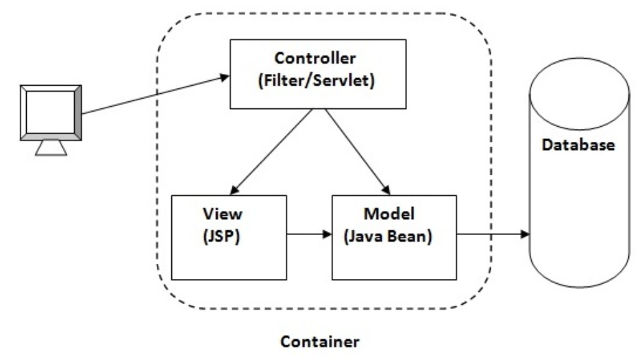
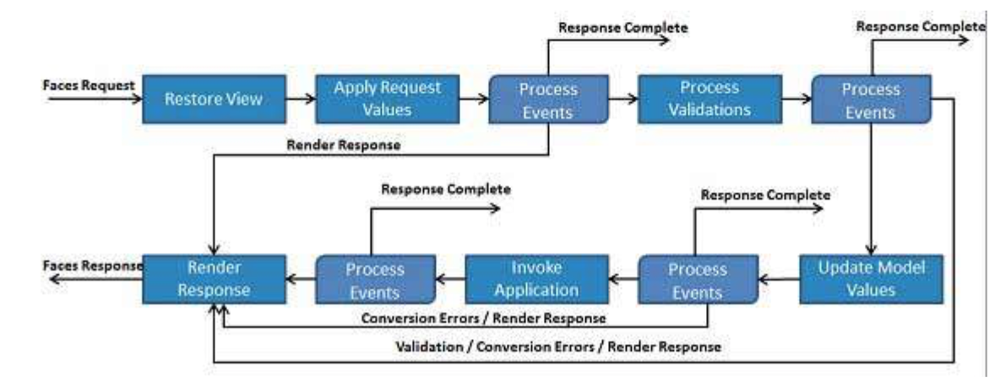

# JSF - Java Server Faces
- current version JSF 2.2
- defined by JSR 344
- version 1.x based on JSP
- version 2.x JSP replaced by Facelets

# JSF - architecture
- MVC 2 architecture (JSP MVC 1)

# JSF - features
- content re-use
- templating
- Facelets for rendering

# JSF - lifecycle
- Phase 1: Restore view
- Phase 2: Apply request values
- Phase 3: Process validation
- Phase 4: Update model values
- Phase 5: Invoke application
- Phase 6: Render response

# JSF - @ManagedBean,@ManagedProperty
- @ManagedBean,@ManagedProperty available, but deprecated
- injection works only in jsf beans
- @ManagedProperty injection via setter
- @Inject annotation not working

# JSF - CDI backing beans
- @Named bean instead
- allows @Inject annotation

# JSF - validators
- built in validators (accessible via tags)
- custom validators (implement javax.faces.validator.Validator)
- validation method in backing bean
- bean validation

# JSF - facelets tags
- templates (insert,define,include,composition)
- paramteters (param)
